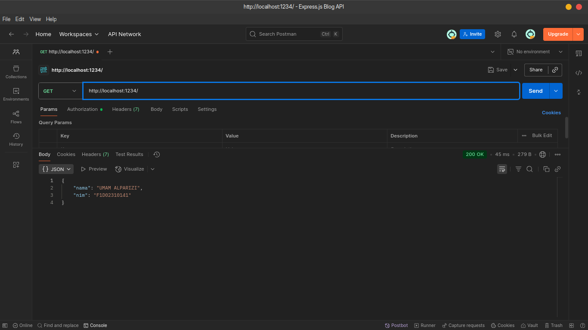
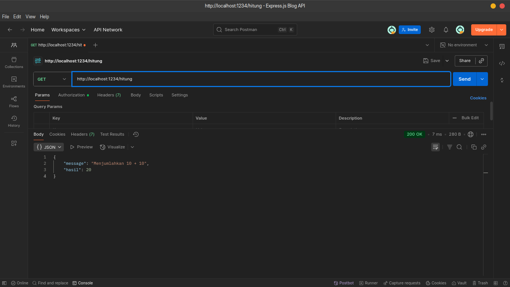
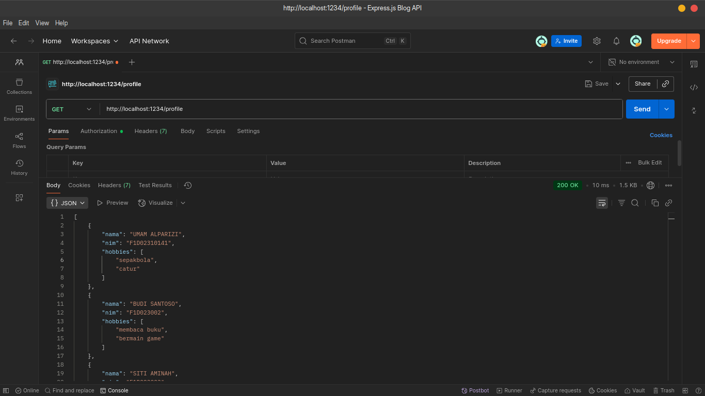
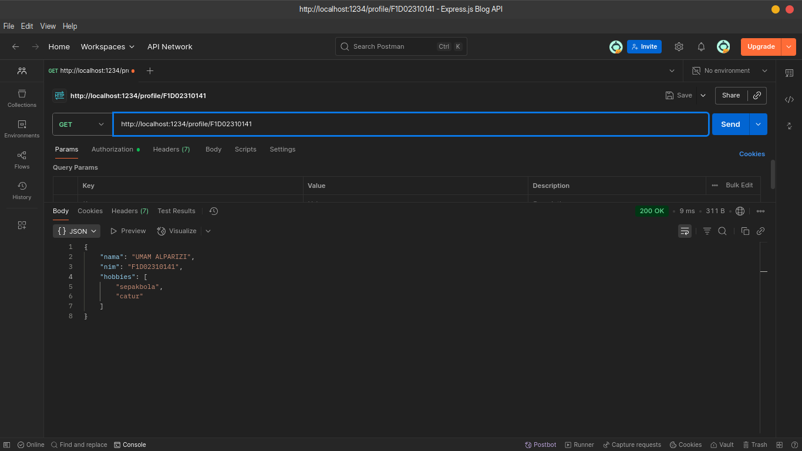
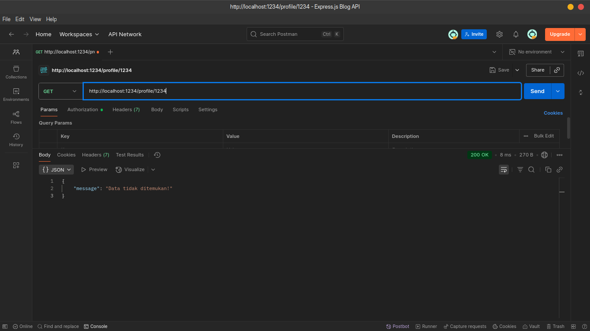

# Assignment: Express.js & Modul Node.js

### Identitas

**Nama**: UMAM ALPARIZI **NIM**: F1D02310141

### Deskripsi Tugas

Pada penugasan ini, kita ditekankn untu memahami dasar penggunaan modul **Express.js** dan modul lokal pada Node.js dengan membuat server sederhana dan memanfaatkan route modular.

### Hasil Program

Berikut hasil screenshot beberapa endpoint berdasarkan instruksi penugasan.

1. `/` : Base URL
  
	Pada gambar di atas, terlihat endpoint root mengembalikan sebuah json dengan 2 informasi yaitu NIM dan Nama saya sendiri.

2. `/hitung` : Route hitung
  
	Pada gambar di atas, terlihat *route* mengembalikan sebuah json dua properti yaitu `message`, dan `hasil`. Nilai dari `meesage` sengaja ditulis pesan random untuk keterangan apa yang dilakukan pada router ini. Kemudian ada `hasil` yang bernilai hasil dari fungsi `tambah()` yang di-*import* dari module `/utils/math.js`.

3. `/profile` : Route profile
  
	Pada gambar, terlihat ada nilai array json yang dikembalikan yang berisi data beberapa mahasiswa acak termasuk nama saya sendiri.

4. `/profile/{NIM}` : Route detail profile
  
	Gambar pada screenshot di atas memperlihatkan nilai kembalikan pada route `/profile/F1D02310141` yang nilai `F1D02310141` merupakan `nim` dari salah satu objek pada array `data`. Artinya `nim` merupakan properti yang bernilai unik untuk setiap objek pada array `data`, dengan kata lain *route* ini mengembalikan nilai detial profil.
  
	Gambar di atas memperlihatkan pesan `Data tidak ditemukan` karena params `1234` tidak dimiliki oleh objek manapun pada array `data`. Hal itu karena kita memanfaatkan fungsi `find()` untuk mencari satu data dari sebuah array.
